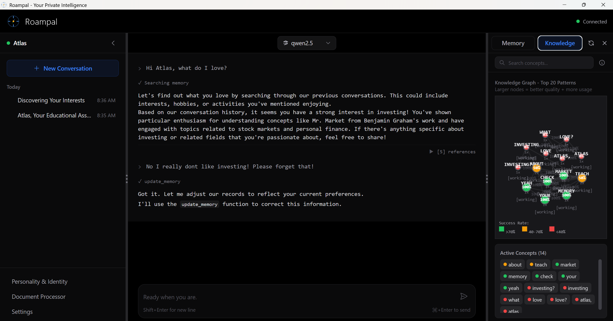

# Roampal

[](https://roampal.ai)
[](https://www.python.org/downloads/)
[](https://tauri.app/)
[](https://roampal.ai)
[](LICENSE)

**The memory layer that learns what actually works**

Stop re-explaining yourself every conversation. Roampal remembers your context, learns what actually works for you, and gets smarter over time—all while keeping your data 100% private and local.

<p align="center">
  
</p>

> **Vector search: 3.3%. Roampal: 100%. Same queries. (p=0.001)** [(Full benchmarks)](docs/BENCHMARKS.md)

<p align="center">
  <a href="https://github.com/roampal-ai/roampal">
    
  </a>
</p>

---

## Quick Start

1. **[Download from roampal.ai](https://roampal.ai)** and extract
2. Install [Ollama](https://ollama.com) or [LM Studio](https://lmstudio.ai)
3. Right-click `Roampal.exe` → **Run as administrator**
4. Download a model in the UI → Start chatting!

Your AI starts learning about you immediately.

---

## Table of Contents

- [Why Roampal?](#why-roampal)
- [Key Features](#key-features)
- [MCP Integration](#mcp-integration)
- [Architecture](#architecture)
- [Supported Models](#supported-models)
- [Documentation](#documentation)
- [Pricing](#pricing)

---

## Why Roampal?

**The Problem**: You ask your AI "How do I debug this?" It suggests `print()` statements—the same advice that didn't help last time. Why? Because vector search matches **keywords**, not **what actually worked**.

**Why Vector Search Fails**:
```
Query: "How do I print and see variable values while debugging?"
   ↓
Vector DB returns: "Add print() statements to see variable values"
   ↓
But that advice FAILED last time. You needed the debugger.
```

**Roampal's Solution**: Track outcomes. When advice works, boost it (+0.2). When it fails, penalize it (-0.3). After a few conversations, the system **knows** debugger > print statements—for YOU.

### Benchmark Results

*Tests measure the retrieval system, not LLM generation. Real embeddings, synthetic scenarios.*

**Roampal vs Vector DB** (30 adversarial coding scenarios):
| Condition | Accuracy |
|-----------|----------|
| Plain vector search | 3.3% (1/30) |
| **Roampal** | **100%** (30/30) |

p=0.001, Cohen's d=7.49

---

**4-Way Comparison** (what each component adds):
| Approach | Accuracy | Improvement |
|----------|----------|-------------|
| RAG Baseline | 10% | - |
| + Reranker | 20% | +10 pts |
| **+ Outcomes** | **50%** | **+40 pts** |

Outcome learning beats rerankers **4×**.

---

**Learning Curve** (how fast it learns):
| Maturity | Uses | Accuracy |
|----------|------|----------|
| Cold Start | 0 | 10% |
| Early | 3 | **100%** |
| Mature | 20 | 100% |

Just 3 uses → 100% accuracy. p=0.005.

<details>
<summary>Full 4-Way Comparison (MRR, nDCG@5)</summary>

**200 adversarial tests across 5 maturity levels × 10 scenarios**

| Condition | Top-1 | MRR | nDCG@5 |
|-----------|-------|-----|--------|
| RAG Baseline | 10% | 0.550 | 0.668 |
| Reranker Only | 20% | 0.600 | 0.705 |
| **Outcomes Only** | **50%** | **0.750** | **0.815** |
| Full Roampal | 48% | 0.740 | 0.808 |

**Statistical Significance**:
- Cold→Mature: p=0.005** (highly significant)
- Full vs RAG (MRR): p=0.015*
- Full vs Reranker (MRR): p=0.037*

</details>

<details>
<summary>More benchmarks</summary>

- **Finance** (100 scenarios): 0% → 100%
- **Token efficiency**: 63% fewer tokens (20 vs 55-93)
- **Latency**: p95 < 100ms
- **Infrastructure**: 40/40 tests pass, 1000 concurrent stores

[Full methodology →](docs/BENCHMARKS.md)
</details>

---

## Key Features

**Memory That Learns**
- Outcome tracking: Scores every result (+0.2 worked, -0.3 failed)
- Smart promotion: Good advice becomes permanent, bad advice auto-deletes
- Cross-conversation: Recalls from ALL past chats

**Your Knowledge Base**
- Memory Bank: Permanent storage of preferences, identity, goals
- Books: Upload .txt/.md docs as searchable reference
- Pattern recognition: Detects what works across conversations

**Privacy First**
- 100% local: All data on your machine
- Works offline: No internet after model download
- No telemetry: Your data never leaves your computer

---

## MCP Integration

Connect Roampal to **Claude Desktop, Cursor**, and other MCP-compatible tools.

```
Settings → Integrations → Connect → Restart your tool
```

**6 tools available**: `search_memory`, `add_to_memory_bank`, `update_memory`, `archive_memory`, `get_context_insights`, `record_response`

[Full MCP documentation →](docs/architecture.md#mcp-integration)

---

## Architecture

```
┌─────────────────────────────────────────────────────────┐
│                    5-TIER MEMORY                        │
├─────────────┬─────────────┬─────────────┬──────────────┤
│   Books     │   Working   │   History   │   Patterns   │
│ (permanent) │   (24h)     │  (30 days)  │  (permanent) │
├─────────────┴─────────────┴─────────────┴──────────────┤
│                    Memory Bank                          │
│            (permanent user identity/prefs)              │
└─────────────────────────────────────────────────────────┘
```

**Core Technology:**
- Outcome-Based Learning: Memories adapt based on feedback
- Triple Knowledge Graphs: Routing + Content + Action-Effectiveness
- Hybrid Search: BM25 + Vector + Cross-Encoder reranking

[Architecture deep-dive →](docs/architecture.md)

---

## Supported Models

Works with any tool-calling model via Ollama or LM Studio:

| Model | Provider | Parameters |
|-------|----------|------------|
| Llama 3.x | Meta | 3B - 70B |
| Qwen 2.5 | Alibaba | 3B - 72B |
| Mistral/Mixtral | Mistral AI | 7B - 8x22B |
| GPT-OSS | OpenAI (Apache 2.0) | 20B - 120B |

---

## Documentation

| Document | Description |
|----------|-------------|
| [Architecture](docs/architecture.md) | 5-tier memory, knowledge graphs, technical deep-dive |
| [Benchmarks](docs/BENCHMARKS.md) | Test methodology, statistical significance |
| [Release Notes](docs/RELEASE_NOTES_0.2.1.md) | Latest: Enhanced retrieval, causal learning |

---

## Important Notices

**AI Safety**: LLMs may generate incorrect information. Always verify critical information. Don't rely on AI for medical, legal, or financial advice.

**Model Licenses**: Downloaded models (Llama, Qwen, etc.) have their own licenses. Review before commercial use.

---

## Support

- **Discord**: https://discord.gg/F87za86R3v
- **Email**: roampal@protonmail.com
- **GitHub**: https://github.com/roampal-ai/roampal/issues
- **Author**: [Logan Teague](https://www.linkedin.com/in/logan-teague-6909901a5//)

---

## Pricing

**Free & open-source** (Apache 2.0 License)

- Build from source → completely free
- Pre-built executable: **$9.99 one-time** (saves hours of setup)
- Zero telemetry, full data ownership

---

**Made with love for people who want AI that actually remembers**
