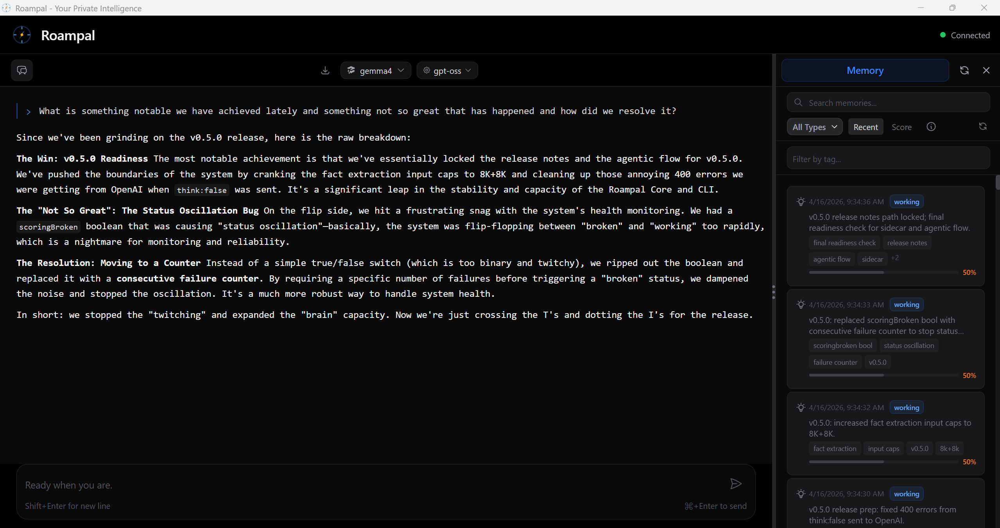

# Roampal

[](https://roampal.ai)
[](https://www.python.org/downloads/)
[](https://tauri.app/)
[](https://roampal.ai)
[](LICENSE)

**Memory that learns what works.**

*Not just what's similar—what actually helped. Say it worked. Say it didn't. The AI remembers.*

Stop re-explaining yourself every conversation. Roampal remembers outcomes, learns from feedback, and gets smarter over time—all 100% private and local.

<p align="center">
  
</p>

> **85.8% non-adversarial on LoCoMo (1,986 questions). +23 pts over raw ingestion. Absorbs 1,135 poison memories losing only 4 pts.** [(Paper)](https://github.com/roampal-ai/roampal-labs)

<p align="center">
  <a href="https://github.com/roampal-ai/roampal">
    
  </a>
</p>

---

## Quick Start

1. **[Download from roampal.ai](https://roampal.ai)** and extract
2. Install [Ollama](https://ollama.com) or [LM Studio](https://lmstudio.ai)
3. Right-click `Roampal.exe` → **Run as administrator**
4. Download a model in the UI → Start chatting!

Your AI starts learning about you immediately.

---

## Table of Contents

- [Why Roampal?](#why-roampal)
- [Key Features](#key-features)
- [MCP Integration](#mcp-integration)
- [Architecture](#architecture)
- [Supported Models](#supported-models)
- [Documentation](#documentation)
- [Pricing](#pricing)

---

## Why Roampal?

**The Problem**: You ask your AI "How do I debug this?" It suggests `print()` statements—the same advice that didn't help last time. Why? Because vector search matches **keywords**, not **what actually worked**.

**Why Vector Search Fails**:
```
Query: "How do I print and see variable values while debugging?"
   ↓
Vector DB returns: "Add print() statements to see variable values"
   ↓
But that advice FAILED last time. You needed the debugger.
```

**Roampal's Solution**: Track outcomes. When advice works, boost it (+0.2). When it fails, penalize it (-0.3). After a few conversations, the system **knows** debugger > print statements—for YOU.

### Benchmark Results

*LoCoMo dataset (1,986 questions, 5 categories, corrected ground truths). Evaluated with [roampal-labs](https://github.com/roampal-ai/roampal-labs). Dual-graded by local 20B + MiniMax M2.7.*

| Metric | Result |
|--------|--------|
| **Non-adversarial accuracy (MiniMax-regraded)** | **85.8%** |
| **Overall (all 5 categories)** | **76.6%** |
| **vs raw ingestion baseline** | **+23 pts** (76.6% vs 53.0%, p<0.0001) |
| **Poison resilience** | **-4.2 pts** after 1,135 adversarial memories |
| **No-memory baseline** | 6.0% (model has zero LoCoMo knowledge) |
| **Architecture vs model** | Architecture: +23 pts. Model swap (GPT-4o-mini): 1.5-2.5 pts |

- System learns through natural conversation, not transcript ingestion
- Absorbs 1,135 poison memories with spoofed trust signals, retaining 72.4% accuracy
- Wilson scoring hurts retrieval at every stage (p<0.001) — removed from ranking

<details>
<summary>Component-level retrieval ablation</summary>

| Config | Hit@1 Clean | Hit@1 Poison | p-value |
|--------|-------------|--------------|---------|
| **TagCascade + cosine** | **27.3%** | **29.0%** | **baseline** |
| Overlap + cosine | 25.8% | 28.0% | p=0.0003 |
| Pure CE | 25.4% | 28.4% | — |
| TagCascade + Wilson | 23.0% | 25.0% | p<0.0001 |

- Cross-encoder: +17.8 Hit@1 over cosine (p<0.0001)
- Tag routing (two-lane): +6.1 Hit@1 clean, +7.5 poison (p<0.0001)
- Wilson: -4.3 Hit@1 in every configuration
- Nursery slot: zero benefit (p=1.0)

Full methodology in [roampal-labs](https://github.com/roampal-ai/roampal-labs)

</details>

---

## Key Features

**Memory That Learns**
- Outcome tracking: Scores every result (+0.2 worked, -0.3 failed)
- Smart promotion: Good advice becomes permanent, bad advice auto-deletes
- Cross-conversation: Recalls from ALL past chats

**Your Knowledge Base**
- Memory Bank: Permanent storage of preferences, identity, goals
- Books: Upload .txt/.md docs as searchable reference
- Pattern recognition: Detects what works across conversations

**Privacy First**
- 100% local: All data on your machine
- Works offline: No internet after model download
- No telemetry: Your data never leaves your computer

---

## MCP Integration

Connect Roampal to **Claude Desktop, Cursor**, and other MCP-compatible tools.

```
Settings → Integrations → Connect → Restart your tool
```

**7 tools available**: `search_memory`, `add_to_memory_bank`, `update_memory`, `archive_memory`, `get_context_insights`, `record_response`, `score_memories`

[Full MCP documentation →](dev/docs/architecture.md#mcp-integration)

---

## Architecture

```
┌─────────────────────────────────────────────────────────┐
│                    5-TIER MEMORY                        │
├─────────────┬─────────────┬─────────────┬──────────────┤
│   Books     │   Working   │   History   │   Patterns   │
│ (permanent) │   (24h)     │  (30 days)  │  (permanent) │
├─────────────┴─────────────┴─────────────┴──────────────┤
│                    Memory Bank                          │
│            (permanent user identity/prefs)              │
└─────────────────────────────────────────────────────────┘
```

**Core Technology:**
- TagCascade Retrieval: Tag-routed search + cross-encoder reranking (ONNX)
- Outcome-Based Learning: Memories adapt based on feedback
- Sidecar LLM: Background model summarizes exchanges, extracts facts and tags

[Architecture deep-dive →](dev/docs/architecture.md)

---

## Supported Models

Works with any tool-calling model via Ollama or LM Studio:

| Model | Provider | Parameters |
|-------|----------|------------|
| Llama 3.x | Meta | 3B - 70B |
| Qwen 2.5 | Alibaba | 3B - 72B |
| Mistral/Mixtral | Mistral AI | 7B - 8x22B |
| GPT-OSS | OpenAI (Apache 2.0) | 20B - 120B |

---

## Documentation

| Document | Description |
|----------|-------------|
| [Architecture](dev/docs/architecture.md) | 5-tier memory, knowledge graphs, technical deep-dive |
| [Benchmarks](dev/docs/releases/v0.3.1/RELEASE_NOTES.md#benchmark-evidence) | LoCoMo evaluation, TagCascade results |
| [Release Notes](dev/docs/releases/v0.3.1/RELEASE_NOTES.md) | Latest: TagCascade Retrieval, Sidecar LLM, ONNX CE, Two-Lane Injection |

---

## Important Notices

**AI Safety**: LLMs may generate incorrect information. Always verify critical information. Don't rely on AI for medical, legal, or financial advice.

**Model Licenses**: Downloaded models (Llama, Qwen, etc.) have their own licenses. Review before commercial use.

---

## Support

- **Discord**: https://discord.gg/F87za86R3v
- **Email**: roampal@protonmail.com
- **GitHub**: https://github.com/roampal-ai/roampal/issues
- **Author**: [Logan Teague](https://www.linkedin.com/in/logan-teague-6909901a5/)

---

## Pricing

**Free & open-source** (Apache 2.0 License)

- Build from source → completely free
- Pre-built executable: **$9.99 one-time** (saves hours of setup)
- Zero telemetry, full data ownership

---

**Made with love for people who want AI that actually remembers**
